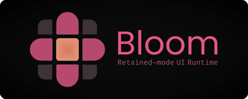

  

## About

Bloom is a retained-mode UI runtime for building desktop applications on the web.

Applications describe widgets, state, and behavior. Bloom owns widget lifetime, layout, event routing, and rendering, maintaining a retained mirror of the application's UI.

## Status

Bloom is currently under active development.

The initial implementation is written in TypeScript and serves as the reference runtime for the project.

## Philosophy

- Retained-mode
- Widget-based
- Runtime-driven
- Protocol-oriented

## License

MIT
