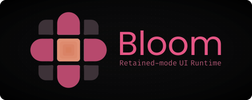

  

## About

Bloom is a batteries-included UI runtime for building desktop applications with Svelte.

Applications define their UI using widgets and panels, while their application logic can be written in any language supported by Bloom's client API. Bloom manages the UI runtime, lifecycle, event routing, commands, and communication between the UI and application.

## Status

Bloom is currently under active development.

The initial implementation uses TypeScript, Svelte, Tauri, and a Rust host, with Python and Rust as the first client implementation targets.

## Philosophy

* Batteries-included
* Widget-based
* Runtime-driven
* Protocol-oriented

## License

MIT
